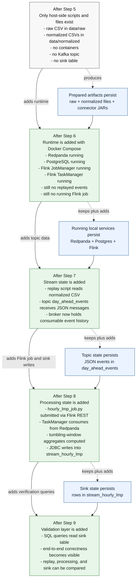

# Step 5 To Step 9 Architecture Evolution
* **step-5-to-9-architecture-evolution.md**:
Shows what exists after each step and what state persists into the next step:
`prepared files after Step 5, runtime after Step 6, topic state after Step 7, sink state after Step 8, visible verification after Step 9`.

