# Step 5 To Step 9 Service Flow
* **step-5-to-9-service-flow.md**:
Shows the actual service and script interactions across Steps 5–9:
`download → normalize → replay → Redpanda topic → Flink job → JDBC sink → Postgres query validation`

```mermaid
flowchart LR
    classDef script fill:#f4f1e8,stroke:#6b5f4a,color:#1f1a14,stroke-width:1px;
    classDef artifact fill:#eef6ff,stroke:#326ea8,color:#102234,stroke-width:1px;
    classDef runtime fill:#edf7ed,stroke:#3a7a3a,color:#102510,stroke-width:1px;
    classDef sink fill:#fff1e8,stroke:#b66a2c,color:#341b08,stroke-width:1px;

    subgraph S5[Step 5 - Prepare replayable files]
        raw_source[ISO-NE day-ahead source]:::artifact --> download[src/ingestion/download_day_ahead.py]:::script
        download --> raw_csv[data/raw/WW_DALMP_ISO_20260317.csv]:::artifact
        raw_csv --> normalize[src/ingestion/normalize_day_ahead.py]:::script
        normalize --> normalized_csv[data/normalized/WW_DALMP_ISO_20260317_normalized.csv]:::artifact
        normalize --> sample_csv[data/normalized/WW_DALMP_ISO_20260317_normalized_small.csv]:::artifact
    end

    subgraph S6[Step 6 - Start local runtime]
        compose[ops/docker/compose.local.yml]:::script --> redpanda[Redpanda broker\ninternal redpanda:9092\nexternal localhost:19092]:::runtime
        compose --> postgres[PostgreSQL\ndb market_data]:::runtime
        compose --> jobmanager[Flink JobManager\nREST :8081]:::runtime
        compose --> taskmanager[Flink TaskManager]:::runtime
        jobmanager --> taskmanager
    end

    subgraph S7[Step 7 - Replay normalized events]
        normalized_csv --> replay[src/replay/replay_day_ahead.py\nrun from main .venv]:::script
        replay --> topic[(Kafka topic\nday_ahead_events)]:::runtime
        redpanda --> topic
    end

    subgraph S8[Step 8 - Aggregate with PyFlink]
        job_script[src/streaming/hourly_lmp_job.py\nrun from .venv-flink]:::script --> jobmanager
        taskmanager --> tumble[Tumbling event-time windows\nper location_name]:::runtime
        topic --> tumble
        tumble --> jdbc_sink[JDBC sink\nstream_hourly_lmp]:::sink
        jdbc_sink --> postgres
    end

    subgraph S9[Step 9 - Validate output]
        query[SQL validation query\npsql or client]:::script --> result[Hourly aggregate checks\nrow counts, avg/max, windows]:::artifact
        postgres --> query
    end

    S5 --> S6 --> S7 --> S8 --> S9
```

